# Deco2017_A3_Readme

My design is to help students improve the quality of learning software. By adding tasks to the desktop, timers, playing music and other means to help users learn better.

## Use guide

### Adding Task
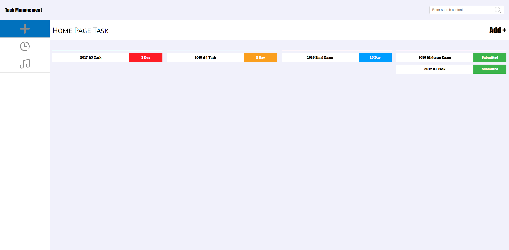

**Users can add tasks through add+ in the upper right corner**
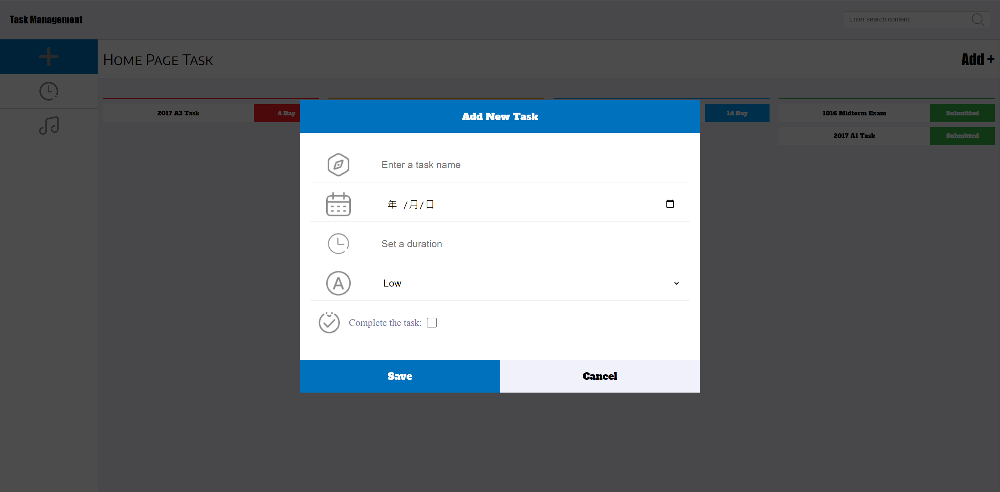
**In the add new task interface, you need to enter correct information, such as task name, completion date, set learning time, priority, and completion status.**
**After adding new tasks, the system will sort the newly added tasks on the home page according to their priority. If the priority is the same, they will be sorted according to the remaining date of the task.**

### Pomodoro Timer
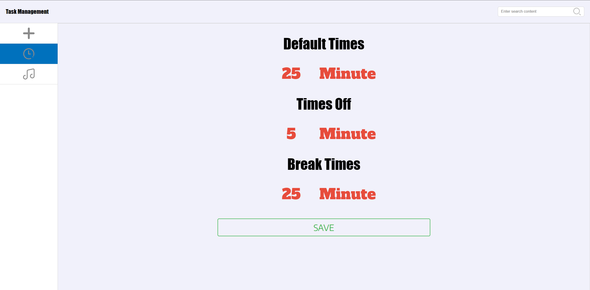

**Click the clock chart on the left to switch the page and switch to the setting interface of pomodoro timer. Here, you can debug to the appropriate time by changing the default times, times off and break times, and finally save the settings by saving.**

### Music
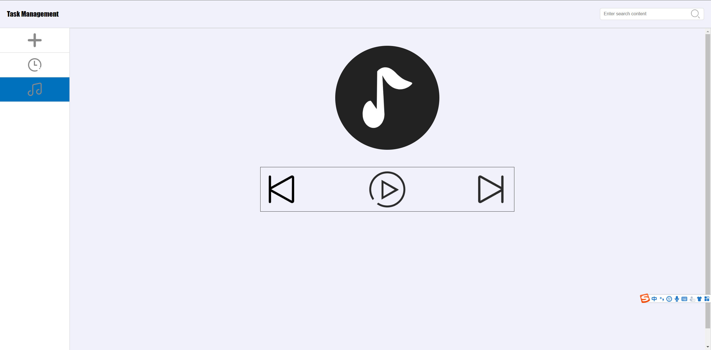
**The last interface on the left taskbar is the music playing interface. You can start and pause music with the start key, and switch music with the switch key. When the music starts playing, it will continue to play even if you switch to another interface.y**

### Modify task information

**What if you want to modify the task information? Click the remaining date after the home page task to change your task again. When you select the completed task status, its status will become "submitted", and you cannot modify it again.**

### Learning interface
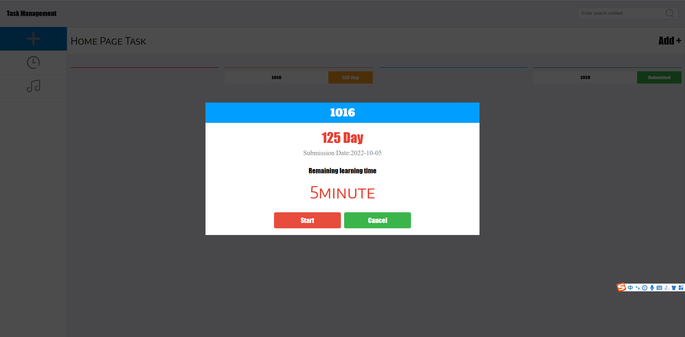
**Click the task name on the home page to enter another interface. In this interface, you will see some information you previously entered. Then you can enter the learning mode or exit the home page by continuing and canceling
In the learning mode, the time is the learning time you originally set in adding tasks. When you click start, the time in the interface will start counting down. When the countdown starts, the start key will become the pause key. You can pause the time through the pause key. The resume key is used to reset the time, and the finish key is used to exit the current interface. When you quit, the time spent will be automatically deducted from your planned time. Of course, the setting of pomodoro timer will also be triggered according to your original setting.**

**After clicking start, you will see the real learning page. The time here is the same as the time you set in the timer interface.**
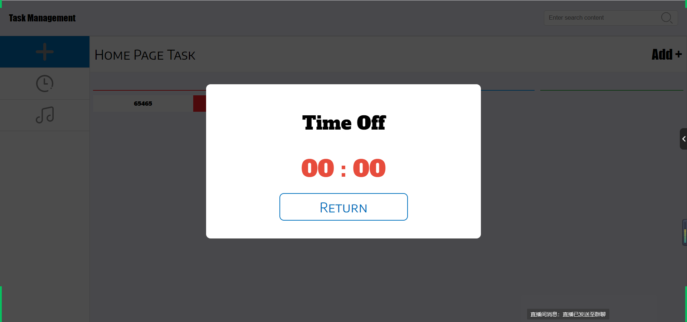
**For example, this is the interface that prompts you to take a rest when the default times arrives.**

## Differences from the original plan

**Why not sort the priority from top to bottom according to the beginning?**

**If the plan is implemented according to the initial plan, the logic will be confused. The priority and date arrangement are not very clear. The current arrangement is not very clear. At the same time, the interface arrangement of the mobile terminal is not very good. The original plan will generate a lot of blank space, but the space utilization can be optimized after modification**
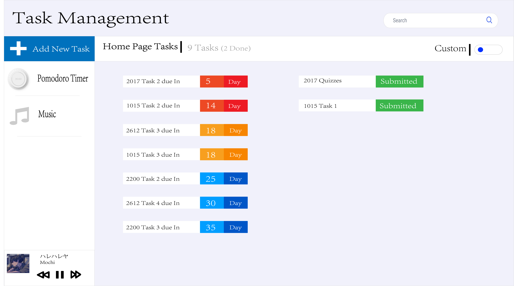

**Why is the switch of pomodoro timer cancelled**
**When I did the switch task, I felt a little complicated, not as simple as I thought at the beginning, so I canceled this part. On the other hand, because the task bar is added on the left side of the web page to switch pages, my final consideration actually does not need a switch. At the same time, it is also to adapt to the mobile terminal for more reasonable synchronization.**
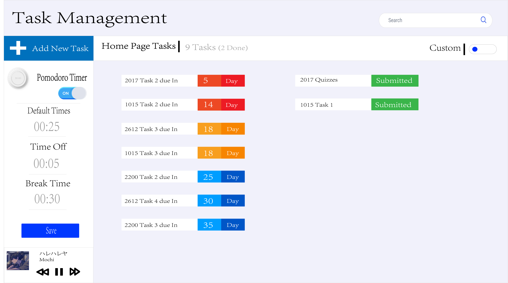

**Why did the entry location for adding tasks change?**
**The addition task originally placed on the left has now become page switching, and the actual operation entry is placed on the right. So a new entry is added to make it more reasonable**

**The music playing position has been changed?**
**Music playback was originally independent of the lower left corner of the page, but it was not very reasonable when actually operating later, because the location of music playback on the mobile terminal and the Web terminal was not related, which was very unreasonable. Therefore, after the newly added taskbar can switch pages, the function of playing music is put into a separate page, so that the mobile terminal and the Web terminal have stronger relevance.**
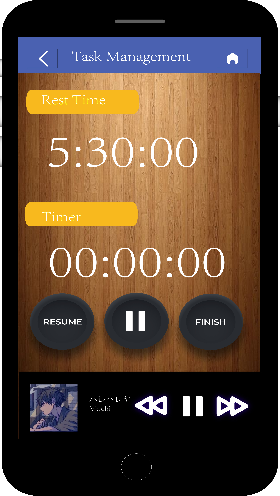
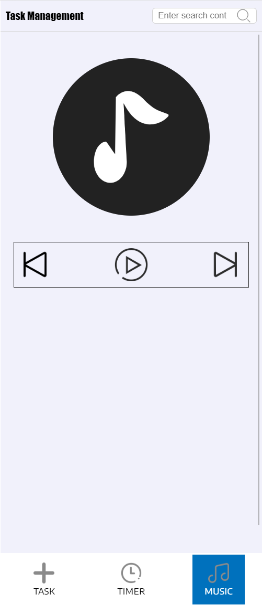

**Why cancel the wooden background used in the learning interface and mobile terminal?**

**The overall design of the rescheduled page is very simple. If you continue to use it without throwing the background, it will be more abrupt**
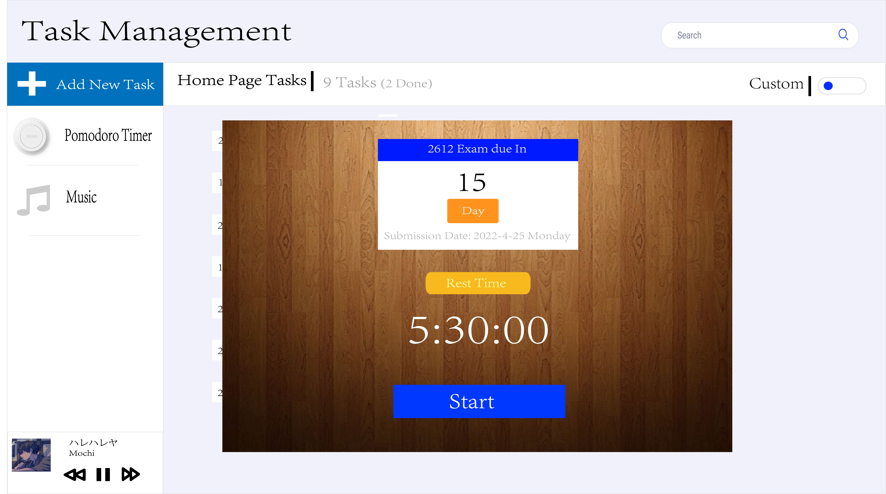

**Why did you cancel the two timers in the original learning interface?**
**The first impression of the two timers was that they were not very reasonable, so they were replaced by a countdown.**

## Testing Procedure

**for the first time:**

**Set up a basic template, do a good job in responding to changes between the computer and the mobile phone, change the display mode of the menu part of the mobile phone, do a good job in page adaptation, and build a basic framework**

**The second time:**

**Develop the function of adding tasks, the data model of resume tasks, add initialization JavaScript files, use the page life cycle of the browser to cache and fetch data, develop and add task pop-up boxes, handle the relationship between task data, dynamically create the taskbar, create through the template string of JavaScript, handle the data processing when the pop-up box is closed, and encapsulate the calculation of remaining days, Encapsulation cancels the addition, clears the information function, performs data binding by using the relationship between the subscripts of the array during addition, adapts the operation during editing, adds a learning pop-up box, encapsulates the start of learning, pauses learning, ends learning, synchronizes the learning time, subtracts the remaining time, encapsulates the timing function, and resets the time function. In order to be compatible with these two functions, Before timing, the original time is copied and backed up to facilitate time reset and prevent data pollution. At this time, the data is deeply copied, and the end rest and packaging are performed. During digital processing, when there are numbers less than 10, the ternary operation is performed, and the zero filling operation is performed**

**Third time:**

**Set the default learning time, add a timing function, declare variables to assign values to the function to facilitate clearing the timer. A large number of timers will cause page jams, which need to be released in time. Define the time object, cache and take out the time object, and package the initialization time function to save the designed function. Add a learning time pop-up, a rest time pop-up, and a music player pop-up, Add a new music array, add a new music playing function, and add a note rotation when playing music. This is achieved by controlling the addition and deletion of class names, defining the initial music subscript, synchronizing the change of variables when changing music, encapsulating the music pause start function, and triggering the music's built-in function to control by obtaining elements**

**The fourth time:**

**Optimize the overall code, check for omissions, consider whether there are bugs, test the project as a whole, separate the JavaScript code, make the code look engineering, cleaner and clearer, separate the CSS and font files, separate the CSS files, classify according to the menu, change the initialization drawing from the for loop to the switch loop, reduce the amount of code, and optimize the code execution sequence and speed, The click function is bound in the template string. Event is used to prevent event bubbling and event penetration. This problem is fixed to make the code execute normally.**

## Reference

 [Music From]([https://www.savethechildren.org.uk/](https://music.163.com/))